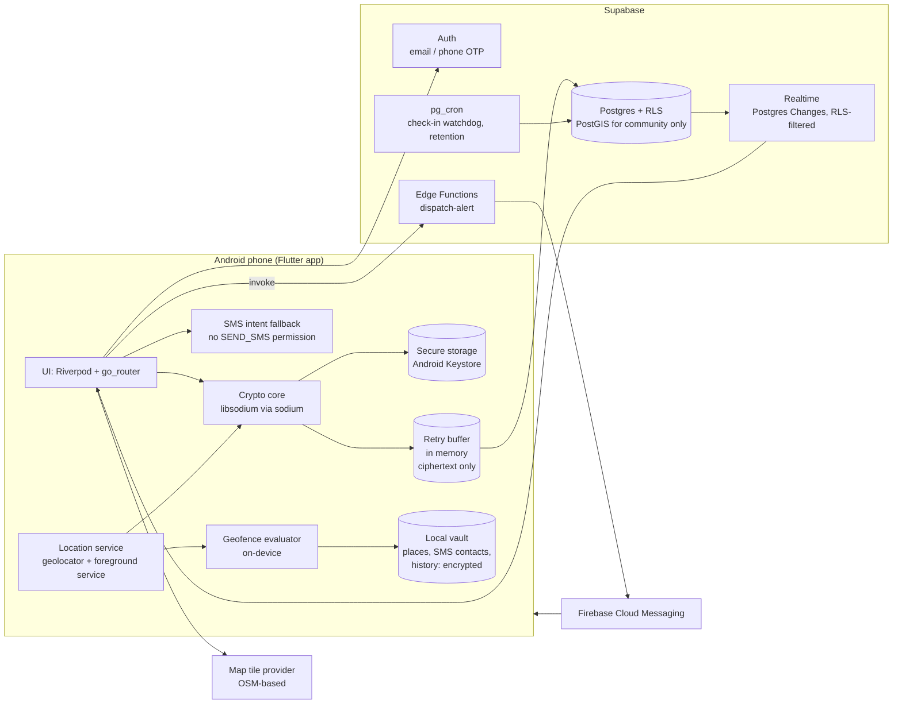
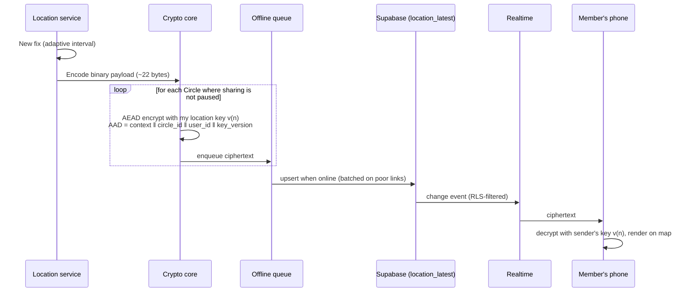
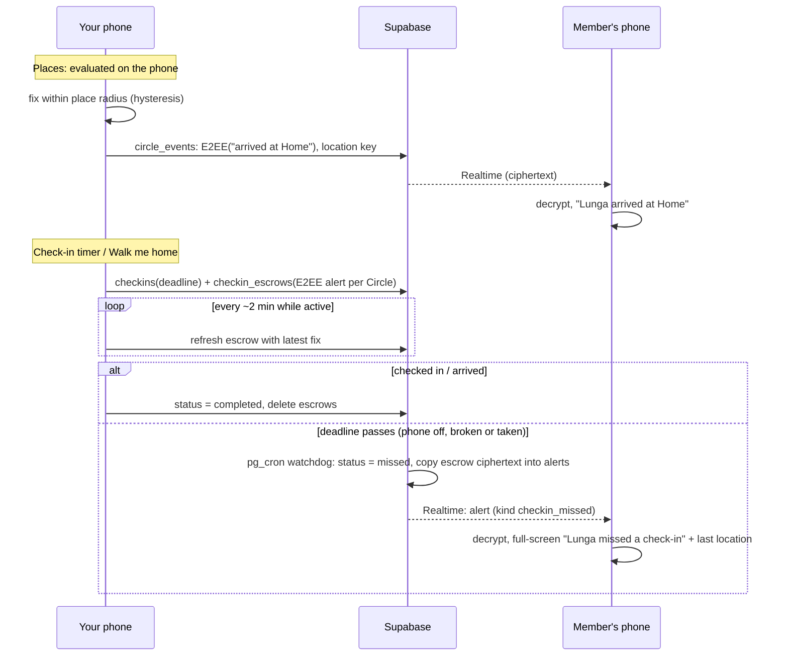
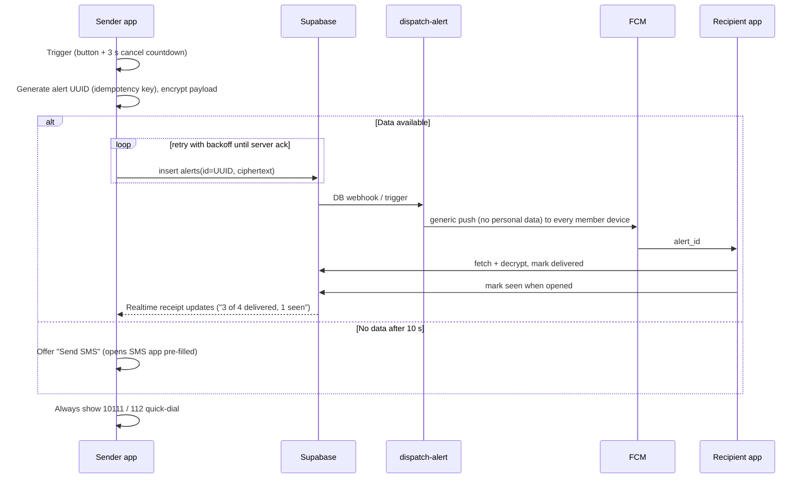

# AfriSafety: Architecture Overview

> Status: **Phases 1 and 2 implemented.** Decisions D1–D7 use the recommended options. D7 (per-sender keys) replaced the single Circle key described in the first draft. Phase 2 keeps places, SMS contacts and history on the phone only (§4.7).
> Package identifier: `za.co.afrisafety.app`

AfriSafety is a privacy-first personal safety and location-sharing app for South
Africa. This document describes the components, how data flows between them, and
where encryption happens. The threat model is in [`../SECURITY.md`](../SECURITY.md)
and the phased build plan is in [`plan.md`](plan.md).

---

## 1. Design principles

1. **The server is a relay, not a reader.** Circle locations, places and alert
   details are end-to-end encrypted. The backend stores and forwards ciphertext.
   Where a feature *must* have plaintext on the server (SMS to non-app contacts,
   community reports), it is opt-in, minimal, short-lived, and documented.
2. **Visible by design.** Location sharing is never silent. A persistent Android
   notification is shown whenever location is collected, and it doubles as the
   foreground-service notification Android requires anyway.
3. **The person being located is always in control.** Pause and Leave are local,
   one-tap actions that no other member can block, delay or override.
4. **Emergencies degrade gracefully.** Data → push; no data → SMS from the phone;
   everything is retried, and the sender always sees delivery status.
5. **Cheap on data, battery and RAM.** Location payloads are about 80 bytes. Updates
   adapt to movement, are queued offline, and are batched on poor connections.
   Target devices are Android 8+ phones with 2 GB of RAM.

---

## 2. Components

### 2.1 Mobile app (Flutter, Android first)

| Concern | Choice | Notes |
|---|---|---|
| State | `flutter_riverpod` 3 (plain providers, no codegen) | Testable, no `BuildContext` coupling |
| Navigation | `go_router` | Deep links for invite links |
| Backend SDK | `supabase_flutter` | Auth, PostgREST, Realtime |
| Location | `geolocator` with Android foreground service | See §5 for justification |
| Maps | `flutter_map` + `latlong2`, OSM-based tiles | Tile caching; follow the provider's usage policy |
| Crypto | `sodium` (libsodium, built from source by build hooks) | X25519, XChaCha20-Poly1305, Ed25519 |
| Key storage | `flutter_secure_storage` | Android Keystore-backed |
| Offline | In-memory | Latest unsent fix per Circle and pending alerts are retried; older fixes are superseded. (drift/SQLite not needed: no codegen, and stale locations have no value) |
| On-device data | `LocalVault` (files sealed with libsodium, key in secure storage) | Places, SMS contacts, location history (§4.7) |
| Push | `firebase_messaging` (optional, configured from dart-defines) | Generic notification with an opaque incident id; details fetched and decrypted in the app |
| Connectivity, battery | `connectivity_plus`, `battery_plus` | Adaptive tracking |
| Sensors | `sensors_plus` | Shake trigger (Phase 3) |
| App lock | `local_auth` + PIN fallback | Phase 3 |
| Dial/SMS | `url_launcher` (`tel:`, `sms:`) | 10111 / 112 quick-dial, SMS intent fallback |
| i18n | `flutter_localizations` + ARB files | English first |

Code is organised **feature-first** (`lib/features/<feature>/{data,domain,presentation}`)
with shared infrastructure in `lib/core/`. See [`plan.md`](plan.md#folder-structure).

### 2.2 Backend (Supabase)

- **Auth:** email OTP during development. Phone OTP in production, which needs an
  SMS provider configured in Supabase.
- **Postgres + Row Level Security:** every table has RLS enabled and deny-by-default.
  Membership checks go through one `SECURITY DEFINER` helper,
  `private.is_circle_member(circle_id)`, with a fixed `search_path`. This avoids
  recursive policies and keeps the logic in one auditable place.
- **Realtime:** Postgres Changes on `circle_members`, `share_levels`,
  `sender_key_envelopes`, `location_latest`, `alerts`, `alert_receipts`,
  `circle_events` and `checkins`. Realtime
  enforces RLS, so subscribers only receive rows for Circles they belong to.
- **Edge Functions (Deno/TypeScript):**
  - `dispatch-alert` (Phase 1): pushes a generic, data-free FCM notification to
    every member device, at most once per alert (§4.6).
  - `send-sms` (not built): server SMS to non-app contacts would put plaintext
    location on our infrastructure, so it waits for explicit approval (§4.5).
- **pg_cron (Phase 2):** `private.expire_checkins()` every minute (the check-in
  watchdog, plain SQL) and `private.purge_expired()` nightly (alerts 30 days,
  events 7 days, finished check-ins 7 days, rate-limit counters 2 days). Rate
  limits are enforced in SQL triggers (`private.hit_rate_limit`).
- **PostGIS:** used only by the Phase 4 community layer (grid-blurred incidents and
  patrol radius matching). Circle locations are ciphertext, so the server cannot run
  spatial queries on them. That is by design.

### 2.3 Third parties and what they see

| Service | Sees | Does not see |
|---|---|---|
| Supabase | Account (email/phone), Circle membership graph, timestamps, ciphertext sizes, IPs, FCM tokens, that a check-in timer exists and its deadline | Locations, places, destinations, alert and event details (E2EE), SMS contacts and history (on the phone only) |
| Firebase (FCM) | That a push was sent to a device, opaque alert ID | Who sent it, location, Circle names |
| Your SMS app / mobile network | The SOS text you choose to send (includes location) | Anything else. AfriSafety never sends SMS itself |
| Tile provider | Approximate viewport area being viewed, IP | Who is being viewed, member locations |

---

## 3. Data model (summary)

Plaintext columns are limited to what the server needs to route, authorise and
delete. Everything location-related is ciphertext.

| Table | Key columns | Plaintext? | Phase |
|---|---|---|---|
| `profiles` | `id` (= `auth.uid()`), `display_name`, `avatar_path` | yes (minimal) | 1 |
| `consents` | `user_id`, `consent_type`, `policy_version`, `granted_at`, `revoked_at` | yes (POPIA record) | 1 |
| `devices` | `user_id`, `box_public_key`, `sign_public_key`, `revoked_at` | public keys only (co-members can read) | 1 |
| `device_push_tokens` | `device_id`, `token` | owner and service role only | 1 |
| `circles` | `id`, `name`, `owner_id` | name is plaintext (warned in UI) | 1 |
| `circle_members` | `circle_id`, `user_id`, `role`, `joined_at`, `sharing_paused` | yes | 1 |
| `circle_invites` | `circle_id`, `code_hash`, `expires_at`, `max_uses`, `uses` | code is **hashed** | 1 |
| `share_levels` | `circle_id`, `sharer_id`, `viewer_id`, `level` (`sos_only`; no row = live) | yes, readable by sharer and viewer only | 1 |
| `sender_key_envelopes` | `circle_id`, `sender_device_id`, `channel` (`location`/`alert`), `key_version`, `recipient_device_id`, `sealed_key`, `signature` | sealed box + Ed25519 signature | 1 |
| `location_latest` | PK(`circle_id`,`user_id`), `sender_device_id`, `key_version`, `ciphertext`, `updated_at` | ciphertext | 1 |
| `alerts` | `id` (client UUID = idempotency key), `incident_id`, `circle_id`, `sender_id`, `sender_device_id`, `kind`, `key_version`, `ciphertext`, `created_at`, `resolved_at`, `dispatched_at` | ciphertext | 1 |
| `alert_receipts` | `alert_id`, `recipient_id`, `delivered_at`, `seen_at` | yes | 1 |
| `security_events` | `user_id`, `kind` (new device, member joined, key changed), `created_at` | yes (user-visible log) | 1 |
| `circle_events` | `id` (client UUID), `circle_id`, `sender_id`, `sender_device_id`, `key_version`, `ciphertext`, `created_at` | ciphertext (event type is inside it); deleted after 7 days | 2 |
| `checkins` | `id`, `user_id`, `kind` (`timer`/`journey`), `deadline`, `status`, `missed_at` | yes: no location, owner-only | 2 |
| `checkin_escrows` | PK(`checkin_id`,`circle_id`), `alert_id`, `sender_device_id`, `key_version`, `ciphertext` | ciphertext (an E2EE alert), owner-only until released | 2 |
| `private.rate_limits` | `bucket`, `subject`, `window_start`, `hits` | yes (not exposed by the API) | 1 |
| `incident_reports` | `category`, `grid_cell` (PostGIS, about 1 km), `occurred_at_bucket` | blurred | 4 |

---

## 4. Where encryption happens

### 4.1 Keys

| Key | Algorithm | Lives | Purpose |
|---|---|---|---|
| Device box keypair | X25519 (`crypto_box`) | 32-byte seed in Keystore-backed secure storage; public half in `devices` | Receive sealed sender keys |
| Device signing keypair | Ed25519 (`crypto_sign`) | same | Sign key envelopes so recipients know which member device created them |
| Sender key (per device × Circle × channel × version) | 256-bit, XChaCha20-Poly1305 (`crypto_aead_xchacha20poly1305_ietf`) | memory only; re-opened from envelopes on start (including the one a device seals to itself) | `location` channel: live location (and places later). `alert` channel: SOS alerts |
| Journey key | 256-bit, same AEAD | sharer's device, recipients via sealed box or URL fragment | Ephemeral "Walk me home" sharing |

Keys are **per device**, not per account, so a lost phone can be revoked without
re-keying the user's other devices.

**Why per-sender keys (D7):** with one shared Circle key, anyone holding it can
read everyone's location, so "SOS alerts only" for one member is impossible. With
sender keys, each person decides who receives their `location` key. Everyone
always receives their `alert` key, so SOS alerts always get through. Rotation is
also local: a sharer only re-keys their own stream.

### 4.2 Location update (hot path)

**Payload format (v1):** `version:u8 | lat:i32 (1e-6°) | lon:i32 | accuracy_m:u16 |
recorded_at:u32 (unix s) | speed_dm_s:u16 | battery_pct:u8 | flags:u8`. That is 19
bytes, plus a 24-byte nonce and a 16-byte tag, so about 60 bytes. Base64 brings it
to about 80 bytes on the wire. The AAD binds the ciphertext to its purpose
(location vs alert), Circle, sender and key version, so the server cannot replay one
member's location as another's, move it between Circles, or pass a location off as
an alert.

### 4.3 Joining a Circle and key distribution

1. A member creates an invite. The server stores `sha256(code)`, an expiry (48 h)
   and a use limit (5). The code is 10 Crockford base32 characters (about 50 bits),
   shown as `XXXXX-XXXXX` so it can be read out over the phone. Redeeming is rate
   limited to 10 attempts an hour, and wrong codes count.
2. The invitee enters the code, sees the Circle name, who invited them and the
   member count, then **accepts or declines**. Joining requires recorded
   location-sharing and 18+ consent.
3. On accept, the server adds the membership and writes a `security_events` row for
   **every** member ("Thandi joined Family").
4. Key sync runs on every device after any membership change (Realtime event,
   app start, resume). Each device plans, per Circle and channel
   (`planKeySync`), which devices are allowed its key. It then seals its current
   key to every allowed device that lacks it, and signs each envelope.
5. Until the other members' phones have been online, the new member sees "Waiting
   for keys from their phone" for them. A phone that is sharing location is online,
   so this is usually seconds.

Envelope signatures are verified against the sender device's public key from
`devices`. That is **trust on first use**: a malicious server could still register
a fake device. In-person QR fingerprint verification (Phase 3) closes that gap.

### 4.4 Leaving, device revocation, downgrades and rotation

A device **rotates** (new key version, sealed only to allowed devices) whenever a
device holding its current key is no longer allowed it:

| Event | What happens |
|---|---|
| Member leaves | `leave_circle` deletes their membership, location, alerts and the envelopes *they* sent. Envelopes sealed *to* them stay but become unreadable to them (RLS requires membership). Remaining devices see them and rotate both channels |
| Device revoked (sign-out, lost phone) | Members rotate away from it. The new phone receives fresh envelopes |
| Viewer set to "SOS alerts only" | The sharer rotates only the `location` key. The viewer keeps getting alerts |

After rotating, the sharer immediately re-uploads their location under the new key,
and deletes envelopes addressed to devices that are no longer allowed
(housekeeping). Rotations are serialised per device, and version numbers never
repeat. **Defence in depth:** RLS cuts a leaver off straight away. Rotation is what
protects against someone who kept old keys or later obtains a database dump.

### 4.5 Where plaintext is unavoidable (documented trade-offs)

| Feature | Why plaintext | Mitigation |
|---|---|---|
| Server-side SMS to non-app emergency contacts | An SMS gateway needs text to send | **Not built.** Phase 2 uses the on-device `sms:` link with the user's saved contacts pre-filled, so no number or location reaches our server. A gateway (`send-sms`) needs the owner's explicit approval first (security rule 3) |
| Missed check-in when phone is dead | Phone can't send anything, so the server must act alone | **Solved without plaintext.** The phone escrows an ordinary E2EE alert per Circle when the check-in starts; the watchdog only copies that ciphertext into `alerts` (§4.8). The server learns that a timer existed and when it ended, never a location |
| Community incident reports (Phase 4) | Server must aggregate and radius-match | Location snapped to a ~1 km grid cell, time bucketed, no user ID stored on the public row |
| Patrol radius alerts (Phase 4) | Server must find nearby patrollers | Opt-in only, coarse grid cell only, per alert |

The **on-device SMS fallback** (`sms:` intent pre-filled with a location link)
needs no server at all and is the true "no data" path. Server-side SMS still
needs the sender to have *some* connectivity.

### 4.6 Push notifications

Phase 1: the `dispatch-alert` Edge Function sends an FCM notification with
**fixed, generic text** ("AfriSafety emergency alert. Someone in your Circle needs
help. Open AfriSafety.") and an opaque incident id. It never includes names,
Circles or locations. Tapping it opens the app, which fetches and decrypts the
alert. Each alert is pushed at most once (`dispatched_at`), only by its sender,
within 10 minutes of being raised.

Later: decrypt in a background isolate and show "Lwazi needs help" without opening
the app.

Missed check-in alerts are released by the server's watchdog, not by a phone,
so nothing calls `dispatch-alert` for them yet. Members get them over Realtime
while AfriSafety is running (which, since Phase 2, includes in the background
while they share their location). Pushing them is a follow-up for when push is
configured (a database webhook on `alerts`).

### 4.7 Data that stays on the phone (vault)

Places, SMS emergency contacts and location history never go to the server.
They live in `LocalVault` (`app/lib/core/storage/local_vault.dart`): one file per
kind in the app's private directory, each sealed with XChaCha20-Poly1305 under a
random vault key held in secure storage (Android Keystore). The file name is the
AAD, so a file can't be swapped for another. Signing out deletes the files and
the key.

Trade-offs: places and history don't follow you to a second phone, and other
members can't see your saved places or your past route. For a safety app those
are features: a Circle member (or a stalker in one) can't set geofences on you
or browse where you've been.

### 4.8 Places, events, check-ins and journeys

- **Events** (place arrive/leave, journey started/arrived/ended, check-in
  started/OK) are sealed with the sender's *location* key, so only members who can
  see the sender's live location can read them. The event type is inside the
  ciphertext. Writes follow the same rule as locations: own active device, not
  paused.
- **Geofencing** uses hysteresis (inside within the radius, outside only beyond
  radius + max(50 m, radius/2)), ignores fixes less accurate than
  max(100 m, radius), and never fires on the first fix after start-up.
- **Escrowed alerts** are sealed with the *alert* key (every member holds it, like
  an SOS) and go to every Circle, paused or not. The server can't read or forge
  them: it can only release them unchanged. RLS stops members reading escrows
  early, and only the watchdog can set `missed`; a missed check-in can't be undone
  by an update, only resolved ("I'm safe").
- **Walking estimate** is straight-line distance × 1.3 at 1.3 m/s, rounded up to
  5 minutes, computed on the phone. No routing service sees the destination. The
  Circle is alerted 10 minutes after the expected arrival; arrival within 150 m
  ends the journey automatically.

---

## 5. Background location: package choice

**Recommendation: `geolocator` (Baseflow) with its Android foreground-service
configuration**, plus our own adaptive-interval logic.

| Option | Pros | Cons |
|---|---|---|
| **`geolocator` + foreground service** ✅ | Free, MIT, widely used, well maintained. Built-in Android foreground notification config. Works on Android 8+ | We write our own motion/stationary heuristics |
| `flutter_background_geolocation` (Transistor) | Best-in-class battery heuristics, motion detection, native geofencing, offline HTTP queue | **Paid licence required for Android release builds.** Large native footprint. Proprietary |
| `background_locator_2` / others | Free | Maintenance has been inconsistent |

Why this fits AfriSafety:
- The **mandatory foreground-service notification is the anti-stalkerware
  indicator.** It is always visible while location is collected. We don't fight it.
- Adaptive strategy (Phase 1 basic, refined in Phase 2):
  - **Moving** (speed > 1 m/s or displacement > 50 m): `distanceFilter` 25 m,
    high accuracy, upload at most every 30 s.
  - **Stationary** (no displacement > 50 m for 5 min): drop to low-power accuracy,
    `distanceFilter` 100 m, heartbeat every 15 min.
  - **Low battery** (< 15 %): heartbeat-only unless a journey or panic is active.
  - **Panic or journey active:** high accuracy, every 10 s, ignores battery saver.
    A journey or check-in keeps the service running even if sharing is paused
    everywhere (the user just asked for it); uploads still only go to Circles
    where they share, and the notification says a check-in is running.
- **Survives swipe-away (Phase 2):** `MainActivity` provides a process-wide Flutter
  engine, so the Dart code keeps running when the activity is destroyed. The
  process stays alive only while the location foreground service (and its
  notification) runs. OEM battery savers can still kill it, hence the in-app
  battery tip.
- Upgrade path: the location layer sits behind a `LocationSource` interface, so we
  can swap in Transistor later without touching features.

Android specifics we must handle: `ACCESS_BACKGROUND_LOCATION` as a separate prompt
(Android 10+), `FOREGROUND_SERVICE_LOCATION` with service type `location`
(Android 14+), `POST_NOTIFICATIONS` (Android 13+), the Play Console background
location declaration and demo video, and OEM battery killers (Xiaomi, Oppo,
Samsung, and Transsion brands Tecno, Infinix and itel, which are very common in
South Africa). The app gets an in-app guide for disabling battery optimisation.

---

## 6. Reliability: panic alert flow

The panic screen always says: *"AfriSafety does not replace emergency services.
In danger, call 10111 (SAPS) or 112."*

---

## 7. Offline, data and low-end device strategy

- **Offline:** the newest unsent fix per Circle is kept in memory and retried
  every 20 s; older fixes are superseded, because a stale location has no value
  and costs data. Since the engine now survives swipe-away, the in-memory retry
  lives as long as sharing does, so an on-disk upload queue wasn't needed
  (history is on the phone, so it has nothing to upload). Panic alerts retry with
  backoff until stored, and the SMS fallback appears after 10 s without
  confirmation. Checking in while offline shows an error and keeps the timer
  visibly running, because the server will still alert at the deadline.
- **Batching:** on 2G/EDGE or when the last request took > 3 s, coalesce uploads.
- **Map data:** tile caching, a "Data saver" mode that shows a list view (name,
  distance, last updated) with no tiles, and tile loading only on demand. Production
  must use a tile provider whose usage policy allows app traffic (or self-hosted
  tiles). The OSMF public tile servers are not for this.
- **Load shedding:** cell towers lose backup power after a few hours, so connectivity
  drops. The queue, SMS fallback and "last updated X min ago" labelling are designed
  for this.
- **No Google Play Services** (e.g. newer Huawei phones): FCM unavailable. The app
  detects this, warns the user, polls while open, and relies on SMS for alerts.
  This is a known limitation.
- **2 GB RAM:** no heavy map SDKs, cap marker counts, isolate-free crypto (libsodium
  is fast enough), and `--split-per-abi` release APKs.

---

## 8. Environments and configuration

- `supabase/` holds migrations, edge functions and pgTAP tests. Local development
  uses `supabase start` (Docker).
- Client config (`SUPABASE_URL`, publishable/anon key, tile URL) is supplied at
  build time via `--dart-define-from-file`. These values are **public by design**:
  security comes from RLS, not from hiding the key.
- Server secrets (service role key, SMS gateway credentials, FCM service account)
  live only in Supabase Edge Function secrets (`supabase secrets set`) and local
  `.env` files that are git-ignored.
- **Hosting region:** POPIA §72 governs cross-border transfers. If Supabase has no
  South African region, we pick the closest region with adequate protection laws
  (e.g. EU) and disclose the transfer in the privacy policy.
