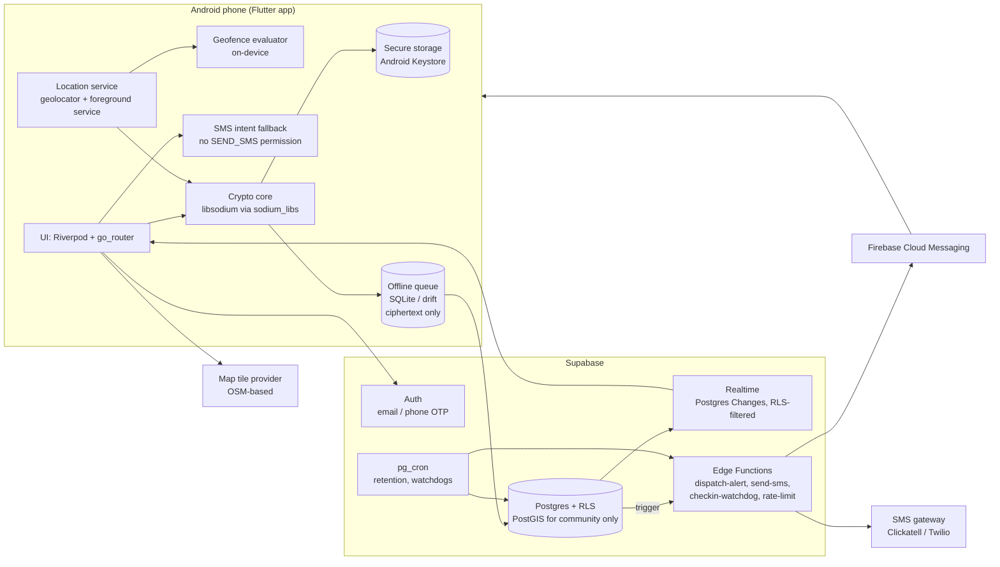
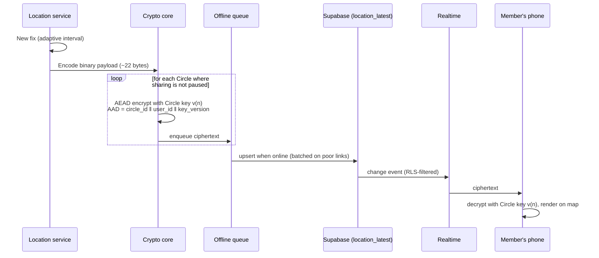
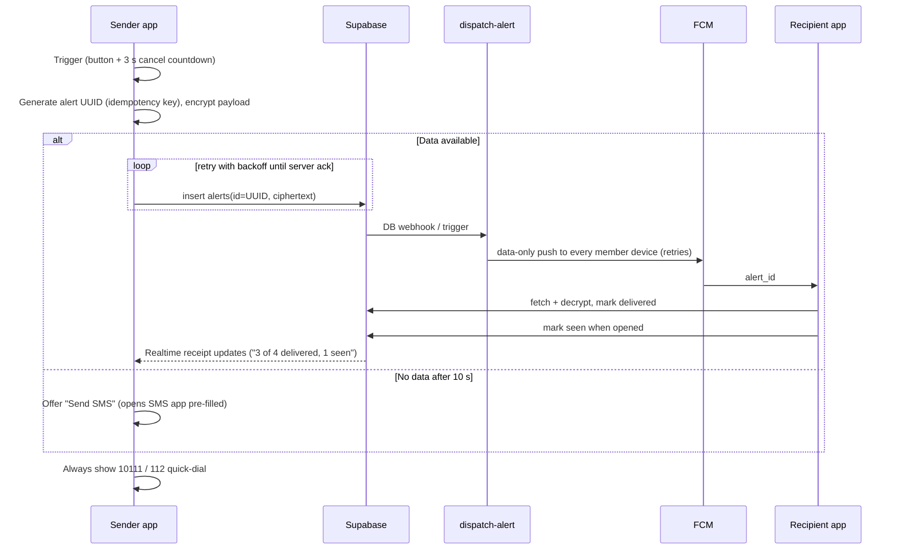

# AfriSafety: Architecture Overview

> Status: **DRAFT for approval.** No application code has been written yet.
> Package identifier: `za.co.afrisafety.app`

AfriSafety is a privacy-first personal safety and location-sharing app for South
Africa. This document describes the components, how data flows between them, and
where encryption happens. The threat model is in [`../SECURITY.md`](../SECURITY.md)
and the phased build plan is in [`plan.md`](plan.md).

---

## 1. Design principles

1. **The server is a relay, not a reader.** Circle locations, places and alert
   details are end-to-end encrypted. The backend stores and forwards ciphertext.
   Where a feature *must* have plaintext on the server (SMS to non-app contacts,
   community reports), it is opt-in, minimal, short-lived, and documented.
2. **Visible by design.** Location sharing is never silent. A persistent Android
   notification is shown whenever location is collected, and it doubles as the
   foreground-service notification Android requires anyway.
3. **The person being located is always in control.** Pause and Leave are local,
   one-tap actions that no other member can block, delay or override.
4. **Emergencies degrade gracefully.** Data → push; no data → SMS from the phone;
   everything is retried, and the sender always sees delivery status.
5. **Cheap on data, battery and RAM.** Location payloads are about 80 bytes. Updates
   adapt to movement, are queued offline, and are batched on poor connections.
   Target devices are Android 8+ phones with 2 GB of RAM.

---

## 2. Components

### 2.1 Mobile app (Flutter, Android first)

| Concern | Choice | Notes |
|---|---|---|
| State | `flutter_riverpod` (+ `riverpod_annotation` codegen) | Testable, no `BuildContext` coupling |
| Navigation | `go_router` | Deep links for invite links |
| Backend SDK | `supabase_flutter` | Auth, PostgREST, Realtime |
| Location | `geolocator` with Android foreground service | See §5 for justification |
| Maps | `flutter_map` + `latlong2`, OSM-based tiles | Tile caching; follow the provider's usage policy |
| Crypto | `sodium_libs` (libsodium) | X25519, XChaCha20-Poly1305, Ed25519 |
| Key storage | `flutter_secure_storage` | Android Keystore-backed |
| Local DB | `drift` (SQLite) | Offline queue and cache. Stores **ciphertext only** |
| Push | `firebase_messaging` + `flutter_local_notifications` | Data-only pushes, decrypted on device |
| Connectivity, battery | `connectivity_plus`, `battery_plus` | Adaptive tracking |
| Sensors | `sensors_plus` | Shake trigger (Phase 3) |
| App lock | `local_auth` + PIN fallback | Phase 3 |
| Dial/SMS | `url_launcher` (`tel:`, `sms:`) | 10111 / 112 quick-dial, SMS intent fallback |
| i18n | `flutter_localizations` + ARB files | English first |

Code is organised **feature-first** (`lib/features/<feature>/{data,domain,presentation}`)
with shared infrastructure in `lib/core/`. See [`plan.md`](plan.md#folder-structure).

### 2.2 Backend (Supabase)

- **Auth:** email OTP during development. Phone OTP in production, which needs an
  SMS provider configured in Supabase.
- **Postgres + Row Level Security:** every table has RLS enabled and deny-by-default.
  Membership checks go through one `SECURITY DEFINER` helper,
  `private.is_circle_member(circle_id)`, with a fixed `search_path`. This avoids
  recursive policies and keeps the logic in one auditable place.
- **Realtime:** Postgres Changes on `location_latest` and `alerts`. Realtime enforces
  RLS, so subscribers only receive rows for Circles they belong to.
- **Edge Functions (Deno/TypeScript):**
  - `dispatch-alert`: fans out data-only FCM pushes to recipients' devices and
    retries with backoff.
  - `send-sms`: sends SMS to opted-in emergency contacts through the gateway.
    This is the only place plaintext location reaches our infrastructure (§4.5).
  - `checkin-watchdog`: run by `pg_cron`. It fires alerts when a check-in deadline
    passes without a check-in.
  - Shared rate-limiting middleware backed by a Postgres table.
- **pg_cron:** location-history retention deletion, expired invites cleanup,
  watchdogs.
- **PostGIS:** used only by the Phase 4 community layer (grid-blurred incidents and
  patrol radius matching). Circle locations are ciphertext, so the server cannot run
  spatial queries on them. That is by design.

### 2.3 Third parties and what they see

| Service | Sees | Does not see |
|---|---|---|
| Supabase | Account (email/phone), Circle membership graph, timestamps, ciphertext sizes, IPs, FCM tokens | Locations, places, alert details (E2EE) |
| Firebase (FCM) | That a push was sent to a device, opaque alert ID | Who sent it, location, Circle names |
| SMS gateway | Emergency contact number + SMS text (includes location) | Anything else. Opt-in per contact |
| Tile provider | Approximate viewport area being viewed, IP | Who is being viewed, member locations |

---

## 3. Data model (summary)

Plaintext columns are limited to what the server needs to route, authorise and
delete. Everything location-related is ciphertext.

| Table | Key columns | Plaintext? | Phase |
|---|---|---|---|
| `profiles` | `id` (= `auth.uid()`), `display_name`, `avatar_path` | yes (minimal) | 1 |
| `consents` | `user_id`, `consent_type`, `policy_version`, `granted_at`, `revoked_at` | yes (POPIA record) | 1 |
| `devices` | `user_id`, `box_public_key`, `sign_public_key`, `fcm_token`, `revoked_at` | public keys only | 1 |
| `circles` | `id`, `name`, `owner_id`, `current_key_version`, `membership_epoch` | name is plaintext (warned in UI) | 1 |
| `circle_members` | `circle_id`, `user_id`, `role`, `joined_at`, `sharing_paused` | yes | 1 |
| `circle_invites` | `circle_id`, `code_hash`, `expires_at`, `max_uses`, `uses` | code is **hashed** | 1 |
| `circle_key_envelopes` | `circle_id`, `key_version`, `device_id`, `sealed_key` | sealed box | 1 |
| `location_latest` | PK(`circle_id`,`user_id`), `key_version`, `ciphertext`, `updated_at` | ciphertext | 1 |
| `alerts` | `id` (client UUID = idempotency key), `circle_id`, `sender_id`, `kind`, `ciphertext`, `created_at`, `resolved_at` | ciphertext | 1 |
| `alert_receipts` | `alert_id`, `recipient_id`, `delivered_at`, `seen_at` | yes | 1 |
| `security_events` | `user_id`, `kind` (new device, member joined, key changed), `created_at` | yes (user-visible log) | 1 |
| `places` | `circle_id`, `key_version`, `ciphertext` (name, centre, radius) | ciphertext | 2 |
| `location_history` | `circle_id`, `user_id`, `key_version`, `ciphertext`, `recorded_at` | ciphertext (timestamp plaintext so it can be deleted) | 2 |
| `journeys` | `owner_id`, `key_version`, `ciphertext`, `expires_at`, `ended_at` | ciphertext | 2 |
| `checkins` | `user_id`, `due_at`, `status`, `sms_escrow_ciphertext` | see §4.5 | 2 |
| `emergency_contacts` | `user_id`, `name`, `phone_e164`, `sms_consent_at` | yes (needed to send SMS) | 2 |
| `rate_limits` | `bucket`, `subject`, `window_start`, `count` | yes | 1 |
| `incident_reports` | `category`, `grid_cell` (PostGIS, about 1 km), `occurred_at_bucket` | blurred | 4 |

---

## 4. Where encryption happens

### 4.1 Keys

| Key | Algorithm | Lives | Purpose |
|---|---|---|---|
| Device box keypair | X25519 (`crypto_box`) | private: Keystore-backed secure storage; public: `devices` | Receive sealed Circle keys |
| Device signing keypair | Ed25519 (`crypto_sign`) | same | Sign key envelopes and rotations so recipients know which member device created them |
| Circle key (per version) | 256-bit, XChaCha20-Poly1305 (`crypto_aead_xchacha20poly1305_ietf`) | memory and secure storage, never on the server in plaintext | Encrypt locations, places, alerts |
| Journey key | 256-bit, same AEAD | sharer's device, recipients via sealed box or URL fragment | Ephemeral "Walk me home" sharing |

Keys are **per device**, not per account, so a lost phone can be revoked without
re-keying the user's other devices.

### 4.2 Location update (hot path)

**Payload format (v1):** `version:u8 | lat:i32 (1e-6°) | lon:i32 | accuracy_m:u16 |
recorded_at:u32 (unix s) | speed_dm_s:u16 | battery_pct:u8 | flags:u8`. That is 19
bytes, plus a 24-byte nonce and a 16-byte tag, so about 60 bytes. Base64 brings it
to about 80 bytes on the wire. The AAD binds the ciphertext to its Circle, sender
and key version, so the server cannot replay one member's location as another's
or move it between Circles.

### 4.3 Joining a Circle and key distribution

1. Inviter creates an invite. The server stores `sha256(code)`, an expiry (48 h) and
   a use count. The code is 10 characters of Crockford base32 (about 50 bits), so it
   can be shared verbally.
2. Invitee enters the code or opens the link, sees the Circle name and who is in it,
   plus a plain-language consent screen, then **accepts or declines**.
3. On accept, the server adds the membership, increments `membership_epoch` and
   writes a `security_events` row for **every** member ("Thandi joined Family").
4. The inviter's device (or any online member device, as a fallback) sees the
   pending member, fetches their device public keys, records their fingerprints
   (trust on first use, with a warning if a known member's key ever changes), and
   writes a signed `crypto_box_seal` envelope of the current Circle key for each new
   device. In Phase 3, members can verify each other's fingerprints in person by
   scanning a QR code, which defeats a server that injects its own key.
5. Until step 4 completes (usually seconds), the new member sees "Waiting for a
   Circle member to come online to share keys."

### 4.4 Leaving, removal, device revocation and key rotation

- **Leave** is a single RPC that deletes the member's row, their `location_latest`
  rows and their envelopes. It can't be blocked and needs no approval. The client
  also wipes the local Circle key.
- The server then sets `circles.rotation_required = true`. The **first remaining
  member device** to come online generates key `v(n+1)`, seals it for all remaining
  devices, signs the rotation, and inserts it. A unique constraint on
  `(circle_id, key_version)` makes concurrent rotations safe: one wins and the
  others fetch it.
- Clients refuse to encrypt with a stale version once a newer one exists.
- **Defence in depth:** even before rotation completes, RLS already stops the
  departed member from reading anything new. Rotation is what protects against a
  departed member who later obtains a database dump.

### 4.5 Where plaintext is unavoidable (documented trade-offs)

| Feature | Why plaintext | Mitigation |
|---|---|---|
| Server-side SMS to non-app emergency contacts | An SMS gateway needs text to send | Opt-in per contact, with a recorded consent. Location sent in-request, never stored. Only for panic, missed check-in or journey alerts |
| Missed check-in when phone is dead | Phone can't send anything, so the server must act alone | Optional "SMS escrow": while a check-in is active, the client uploads a short-lived location escrow the server can read. It is deleted when the check-in ends. Push alerts to app members stay E2EE (they decrypt last known location themselves) |
| Community incident reports (Phase 4) | Server must aggregate and radius-match | Location snapped to a ~1 km grid cell, time bucketed, no user ID stored on the public row |
| Patrol radius alerts (Phase 4) | Server must find nearby patrollers | Opt-in only, coarse grid cell only, per alert |

The **on-device SMS fallback** (`sms:` intent pre-filled with a location link)
needs no server at all and is the true "no data" path. Server-side SMS still
needs the sender to have *some* connectivity.

### 4.6 Push notifications

FCM messages are **data-only and contain only an opaque alert ID**. The app's
background handler fetches the encrypted alert, decrypts it, and shows a local
notification ("Emergency: Lwazi needs help, tap for location"). If decryption or
fetch fails, it falls back to a generic "AfriSafety emergency alert. Open the app."

---

## 5. Background location: package choice

**Recommendation: `geolocator` (Baseflow) with its Android foreground-service
configuration**, plus our own adaptive-interval logic.

| Option | Pros | Cons |
|---|---|---|
| **`geolocator` + foreground service** ✅ | Free, MIT, widely used, well maintained. Built-in Android foreground notification config. Works on Android 8+ | We write our own motion/stationary heuristics |
| `flutter_background_geolocation` (Transistor) | Best-in-class battery heuristics, motion detection, native geofencing, offline HTTP queue | **Paid licence required for Android release builds.** Large native footprint. Proprietary |
| `background_locator_2` / others | Free | Maintenance has been inconsistent |

Why this fits AfriSafety:
- The **mandatory foreground-service notification is the anti-stalkerware
  indicator.** It is always visible while location is collected. We don't fight it.
- Adaptive strategy (Phase 1 basic, refined in Phase 2):
  - **Moving** (speed > 1 m/s or displacement > 50 m): `distanceFilter` 25 m,
    high accuracy, upload at most every 30 s.
  - **Stationary** (no displacement > 50 m for 5 min): drop to low-power accuracy,
    `distanceFilter` 100 m, heartbeat every 15 min.
  - **Low battery** (< 15 %): heartbeat-only unless a journey or panic is active.
  - **Panic or journey active:** high accuracy, every 10 s, ignores battery saver.
- Upgrade path: the location layer sits behind a `LocationSource` interface, so we
  can swap in Transistor later without touching features.

Android specifics we must handle: `ACCESS_BACKGROUND_LOCATION` as a separate prompt
(Android 10+), `FOREGROUND_SERVICE_LOCATION` with service type `location`
(Android 14+), `POST_NOTIFICATIONS` (Android 13+), the Play Console background
location declaration and demo video, and OEM battery killers (Xiaomi, Oppo,
Samsung, and Transsion brands Tecno, Infinix and itel, which are very common in
South Africa). The app gets an in-app guide for disabling battery optimisation.

---

## 6. Reliability: panic alert flow

The panic screen always says: *"AfriSafety does not replace emergency services.
In danger, call 10111 (SAPS) or 112."*

---

## 7. Offline, data and low-end device strategy

- **Offline queue:** ciphertext in SQLite. Only the latest fix per Circle is kept
  for `location_latest`. History points are batched (Phase 2). Alerts are never
  dropped.
- **Batching:** on 2G/EDGE or when the last request took > 3 s, coalesce uploads.
- **Map data:** tile caching, a "Data saver" mode that shows a list view (name,
  distance, last updated) with no tiles, and tile loading only on demand. Production
  must use a tile provider whose usage policy allows app traffic (or self-hosted
  tiles). The OSMF public tile servers are not for this.
- **Load shedding:** cell towers lose backup power after a few hours, so connectivity
  drops. The queue, SMS fallback and "last updated X min ago" labelling are designed
  for this.
- **No Google Play Services** (e.g. newer Huawei phones): FCM unavailable. The app
  detects this, warns the user, polls while open, and relies on SMS for alerts.
  This is a known limitation.
- **2 GB RAM:** no heavy map SDKs, cap marker counts, isolate-free crypto (libsodium
  is fast enough), and `--split-per-abi` release APKs.

---

## 8. Environments and configuration

- `supabase/` holds migrations, edge functions and pgTAP tests. Local development
  uses `supabase start` (Docker).
- Client config (`SUPABASE_URL`, publishable/anon key, tile URL) is supplied at
  build time via `--dart-define-from-file`. These values are **public by design**:
  security comes from RLS, not from hiding the key.
- Server secrets (service role key, SMS gateway credentials, FCM service account)
  live only in Supabase Edge Function secrets (`supabase secrets set`) and local
  `.env` files that are git-ignored.
- **Hosting region:** POPIA §72 governs cross-border transfers. If Supabase has no
  South African region, we pick the closest region with adequate protection laws
  (e.g. EU) and disclose the transfer in the privacy policy.
